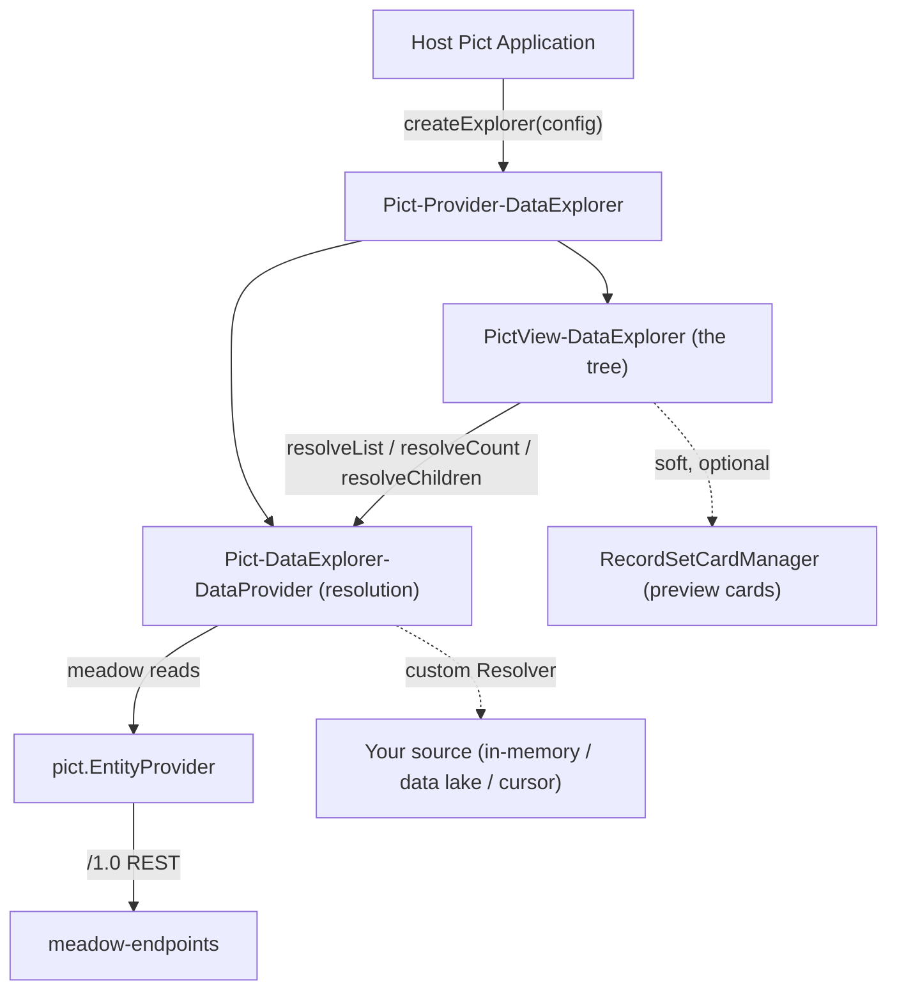
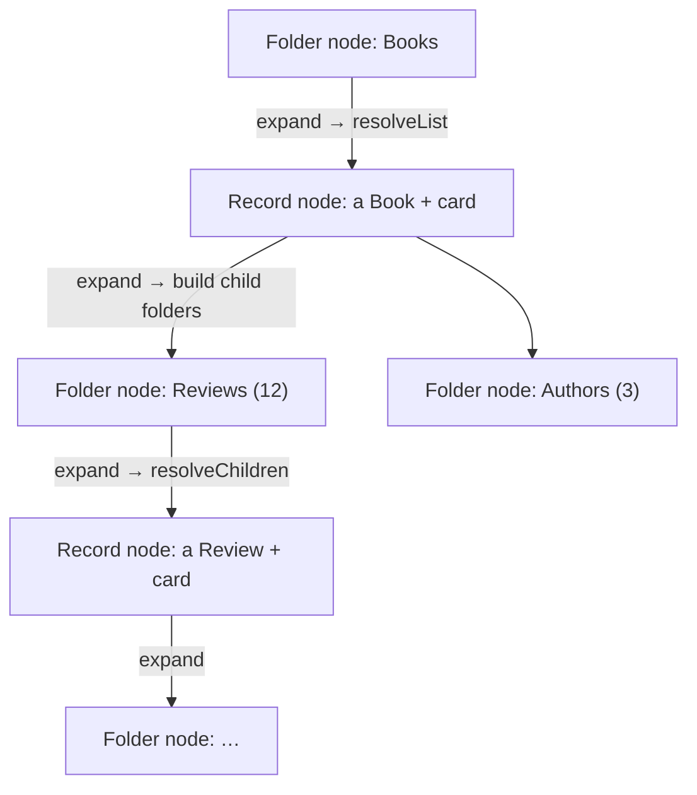

# Architecture

Pict-DataExplorer is three small pieces — a **provider** (the API surface), a **resolution layer** (where data comes from), and a **view** (the tree) — wired together by a single config graph. Preview cards are an optional fourth piece the view reaches for only if the host provides it.

## High-Level Design

- **Pict-Provider-DataExplorer** — the API surface. `createExplorer(hash, config)` normalizes the config and spins up a view; `registerCards(map)` passes card layouts through to the (soft) card manager.
- **Pict-DataExplorer-DataProvider** — the resolution layer. Stateless: every method takes the resolved entity config it needs, so one instance serves any number of explorers. The default path reuses `pict.EntityProvider`; a `Resolver` function bypasses meadow entirely.
- **PictView-DataExplorer** — the folder tree. Owns the node state and the expand / load / render machinery.
- **RecordSetCardManager** — a soft runtime dependency from [pict-section-recordset](https://github.com/fable-retold/pict-section-recordset). Present → records get a ⓘ card; absent → plain text.

## The Node Model

The tree alternates two kinds of node. A **record node** is a single record; it expands to its child **folders**. A **folder node** is a labeled child collection under a record; it expands to its member **records**. They alternate all the way down:

Nodes are keyed by a stable path — `root:Book/rec:1042/fld:Reviews/rec:88` — so collapse, re-expand and pagination are idempotent. A node at the configured `MaxDepth` renders its caret disabled, which bounds otherwise-circular graphs (Book → Authors → Books → …).

## The Resolution Layer

`resolveChildren` dispatches on the relationship type, and `resolveList` / `resolveCount` underpin them all:

| Relationship | Shape | How it resolves |
|---|---|---|
| `Filter` (1:N) | child holds the FK | `resolveList(child, FBV~Key~EQ~parentID)` |
| `Join` (M:N) | a join entity | page the join projecting only the child key → dedupe ids → one batched `INN` child read → reorder to join order (pagination rides the join) |
| `Reference` (N:1) | parent holds the FK | `resolveList(child, FBV~childID~EQ~parent[Key])` — one row |
| `Resolver` (custom) | a function | `Resolver(parentRecord, { begin, count })` → `{ records, hasMore, count? }` — no meadow at all |

Meadow reads go through `pict.EntityProvider.getEntitySetPage(...)` with a `LiteExtended` projection (only the `Lite` columns plus ids/audit), so list payloads stay small. Counts go through `getEntitySetRecordCount`. Because projected rows are intentionally uncached, the explorer hands the **already-loaded record** to a preview card rather than re-fetching it.

## The Rendering Strategy

Pict templates cannot self-recurse to unbounded depth, so the tree crosses each record ↔ folder tier boundary in JavaScript: when a node expands, its children are rendered with `parseTemplateByHash()` and assigned into that node's **stable child container** via `ContentAssignment`. The flat list of records inside a single folder is a normal `{~TS:~}` iteration.

The crucial discipline: **AppData holds only node data and flags — never HTML.** The rendered markup lives transiently in the DOM, re-written per node on expand; `AppData.PictDataExplorer.<hash>.Nodes[key]` holds the record, counts, member keys, pagination cursor and expand flags. Toggling a node re-renders only that node's inner (to flip its caret) and its child container — siblings are never touched, so re-rendering a subtree never re-fetches the rest of the tree.

## Design Decisions

- **Lazy counts avoid a count-storm.** A record may have many child folders, and the tables behind them can be huge. So child-folder counts resolve only when the *parent record* is expanded — never for collapsed root rows — and are cached on the node. A `Resolve` mode (`'lazy'` / `'count'` / `'eager'`) tunes this per relationship.
- **The card manager is soft, by design.** The view checks `this.pict.providers.RecordSetCardManager` at render time and degrades to plain text when it is absent. The package has no hard dependency on pict-section-recordset.
- **The resolution layer is source-agnostic.** The meadow path is the convenient default, but a `Resolver` on any entity or relationship lets the same tree explore a data lake, a cursor API, or an in-memory dataset — which is exactly how the [Music Explorer example](examples/music_explorer/README.md) runs with no backend at all.
